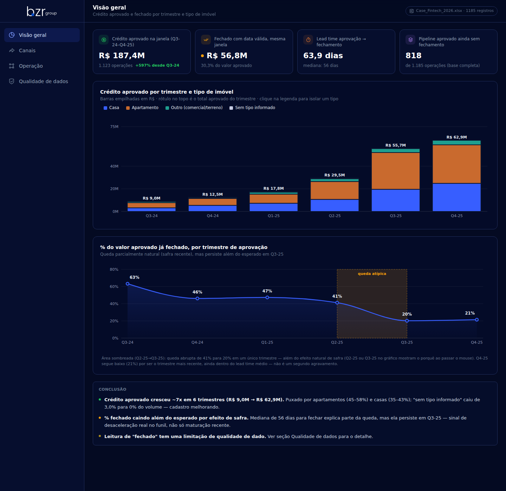
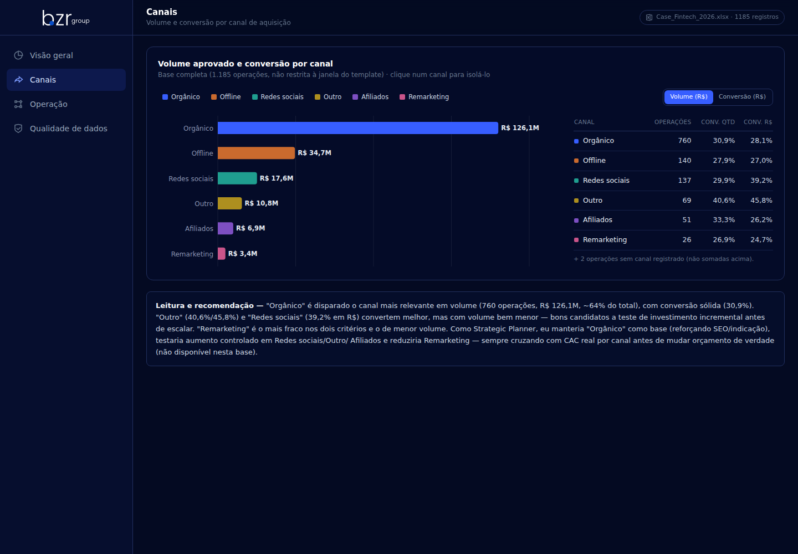
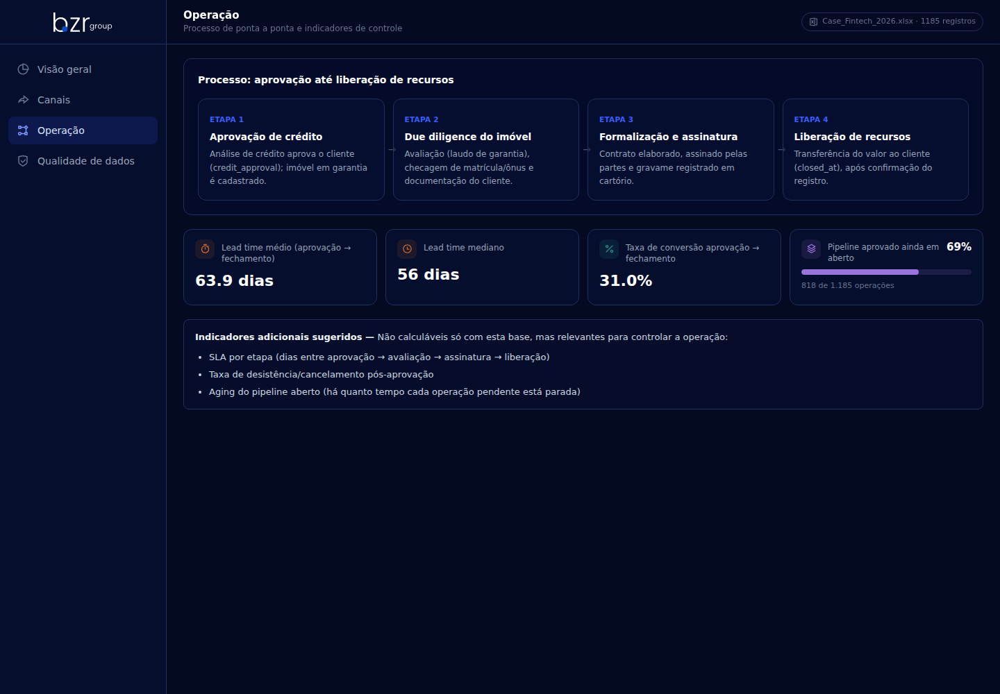
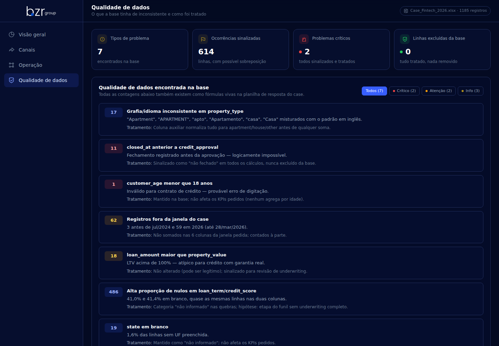
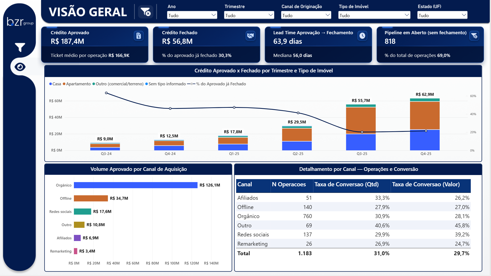

<div align="center">

</div>

<div align="center">

# 🏠 BZR Group — Dashboard Home Equity

**Dashboard web que resolve o case de avaliação "Pricing & PM Analyst Jr." da BZR Group**,
lendo uma base fictícia de crédito com garantia de imóvel (Home Equity) e respondendo às 4
perguntas do case com um pipeline Python + Excel + React construído do zero com IA
(Claude), fórmulas vivas e validação cruzada ponta a ponta — documentados abaixo.

[](https://bzr-group.vercel.app/)
[](https://github.com/victor-ozores/BZR-Group)
[](./LICENSE)

[](https://linkedin.com/in/victor-ozores/)
[](https://app.xperiun.com/in/victor-ozores-2)
[](https://github.com/victor-ozores)

</div>

---

## 📌 Resumo

A BZR Group forneceu uma base fictícia de 1.185 operações de crédito com garantia de imóvel
(Home Equity) aprovadas entre jul/2024 e mar/2026, pedindo uma leitura do funil de aprovação
até fechamento, dos canais de aquisição e da qualidade da base.

**Resultado no período do template (Q3-2024–Q4-2025, 1.123 operações):** R$ 187,4M aprovados,
R$ 56,8M fechados (**30,3%**), lead time médio de **63,9 dias** (mediana 56). O achado
central: o % fechado cai de 63% (Q3-24) para 20% (Q3-25) — parte é efeito natural de safra
(operações recentes ainda não tiveram tempo de fechar), mas a queda persiste além do esperado
mesmo em trimestres já maduros, sugerindo uma desaceleração real no funil, não só efeito de
cohort. "Orgânico" é o canal mais relevante em volume (760 operações, R$ 126,1M, ~63% do
total).

## 🔗 Ver Dashboards Online

[](https://bzr-group.vercel.app/)
[](https://app.powerbi.com/view?r=eyJrIjoiY2QwNGExOTMtZjQyMS00MWU0LWI4NTYtZWZlNjJjNDIzZTk5IiwidCI6IjY1OWNlMmI4LTA3MTQtNDE5OC04YzM4LWRjOWI2MGFhYmI1NyJ9&pageName=b2ef2f6eecd6003e150c)

## 📢 Apresentação do Projeto

[](https://claude.ai/artifact/L237gqgbAUqw5kjHXh58f8)

---

## 💡 O Que Ele Responde

As 4 perguntas do case (aba `Questions` do `Case_Fintech_2026.xlsx`):

- **Q1** — Preencher a área de Credit Approved/Closed por trimestre e tipo de imóvel — quais
  conclusões podem ser tiradas?
- **Q2** — Qual canal é mais relevante em volume? E em conversão? Como um Strategic Planner
  distribuiria investimento entre eles?
- **Q3** — Desenho do processo de aprovação até liberação de recursos e os indicadores de
  controle da operação.
- **Q4** — Problemas de qualidade/inconsistência encontrados na base e como foram tratados.

Respostas completas, com fórmulas vivas (SUMIFS/COUNTIFS/VLOOKUP direto na `DataBase`), em
[`Case_Fintech_2026_Victor_RESPOSTA.xlsx`](./Case_Fintech_2026_Victor_RESPOSTA.xlsx) — inclui
uma aba extra **Cálculos** que reconcilia, célula a célula, os números do Excel com os do
dashboard.

Para uma leitura corrida e formatada — pensada para quem não vai abrir a planilha — ver
[`notas/Solucao - Case Fintech 2026 Home Equity.pdf`](./notas/Solucao%20-%20Case%20Fintech%202026%20Home%20Equity.pdf).

## 📊 Páginas do Dashboard

| Seção | O que mostra |
|---|---|
| **Visão geral** | KPIs gerais, crédito aprovado x fechado por trimestre e tipo de imóvel, tendência de % fechado com zona de queda atípica |
| **Canais** | Volume e conversão por canal de aquisição, com filtro por clique na legenda |
| **Operação** | As 4 etapas do processo (aprovação → due diligence → formalização → liberação) e indicadores de controle |
| **Qualidade de dados** | 7 problemas encontrados na base, quantidade e tratamento de cada um, com filtro por severidade |

## 📸 Preview

**Versão React**

<div align="center">

<br><br>

<br><br>

<br><br>

</div>

**Versão Power BI**

<div align="center">

</div>

<details>
<summary><b>⚙️ Detalhes Técnicos</b></summary>

### Arquitetura

```
Case_Fintech_2026.xlsx (bruto, aba DataBase)
        │
        ▼
  etl_kpis.py              → limpa/normaliza, calcula KPIs (Q1/Q2/Q3), idempotente
        │
        ▼
  dados/interim/kpis.json   → agregado testado (6 testes automatizados)
        │
        ▼
  05_export_dashboard.py    → reshape pro formato do dashboard, sem recalcular nada
        │
        ▼
  dashboard/public/data/dashboard_data.json  (fonte única de verdade do front)
        │
        ▼
  React + Vite + Tailwind + Recharts + Framer Motion  →  deploy Vercel (bzr-group.vercel.app)
```

Em paralelo, `Case_Fintech_2026_Victor_RESPOSTA.xlsx` recalcula os mesmos números com
fórmulas Excel nativas (SUMIFS/COUNTIFS/VLOOKUP direto na `DataBase`) — nunca valor fixo — e
a aba **Cálculos** confere linha a linha contra o `dashboard_data.json`.

### Indicadores calculados

| Indicador | Fórmula |
|---|---|
| Credit Approved (R$) | soma de `loan_amount` por trimestre de `credit_approval`, na janela Q3-24–Q4-25 |
| Closed (R$) | soma de `loan_amount` onde `closed_at` preenchido e ≥ `credit_approval` |
| % Closed | Closed / Credit Approved |
| Lead time médio/mediano | dias entre `credit_approval` e `closed_at`, só fechamentos válidos |
| Taxa de conversão geral | nº de fechados válidos / total de operações da base |
| Pipeline aberto | total de operações − fechados válidos |
| Volume e conversão por canal | agregado por `channel`, base completa (1.185, não restrita à janela) |

### Stack

- **Python + pandas** — ETL, cálculo dos KPIs e testes (`/scripts`, `/tests`)
- **openpyxl + LibreOffice headless** — planilha de resposta com fórmulas vivas, recalculada
  e conferida fora do Excel antes da entrega
- **React + Vite + Tailwind CSS + Recharts + Framer Motion** — dashboard (`/dashboard`)
- **Vercel** — hospedagem estática ([bzr-group.vercel.app](https://bzr-group.vercel.app/))
- **Power BI Desktop + DAX** — segunda versão do dashboard, mesmo case e mesmos números, star schema com medidas documentadas ([abrir dashboard](https://app.powerbi.com/view?r=eyJrIjoiY2QwNGExOTMtZjQyMS00MWU0LWI4NTYtZWZlNjJjNDIzZTk5IiwidCI6IjY1OWNlMmI4LTA3MTQtNDE5OC04YzM4LWRjOWI2MGFhYmI1NyJ9&pageName=b2ef2f6eecd6003e150c), arquivo em [`BZR_Group.pbix`](./BZR_Group.pbix))

Todo o pipeline foi construído com o **Claude**, incluindo a decisão de manter a
`Case_Fintech_2026.xlsx` original intocada e derivar tudo (Python e Excel) a partir dela.

### Dados e confidencialidade

A base (`Case_Fintech_2026.xlsx`, aba `DataBase`, 1.185 linhas × 14 colunas) é declaradamente
**fictícia** — a própria aba `Questions` do arquivo original afirma isso ("dados fictícios de
clientes"). Não há nome, CPF, e-mail, telefone ou geolocalização granular; `state` é só UF e
`customer_age`/`monthly_income` não identificam ninguém nesta base sintética — por isso não
foi necessária nenhuma pseudonimização. O case em si é material de avaliação da BZR Group
para a vaga de Pricing & PM Analyst Jr.; publicado aqui como registro de portfólio da
resolução.

### Padrões aplicados

| Padrão | Onde |
|---|---|
| Pipeline determinístico e idempotente | `scripts/etl_kpis.py` — roda 2x, mesmo resultado byte a byte |
| Testes automatizados | `tests/test_kpis.py` (6 testes) e `test_dashboard_export.py` |
| Fonte única de verdade | um único `dashboard_data.json`, nunca recalculado no reshape |
| Fórmula viva, nunca valor fixo | Excel de resposta inteiro (SUMIFS/COUNTIFS/VLOOKUP) |
| Validação cruzada | Python (pandas) × Excel (LibreOffice headless) — bateram 100% |

### Limitações conhecidas

- Dataset fictício e estático — o dashboard não recebe dados novos.
- Sem autenticação — todas as seções são acessíveis a quem tiver o link.
- 62 registros da base (3 antes de jul/2024, 59 em 2026) ficam fora da janela pedida pelo
  template e não entram nas colunas de Q1 — contados à parte na Qualidade de dados.

### Estrutura do repositório

```
Case_Fintech_2026.xlsx                  → base original, intocada
Case_Fintech_2026_Victor_RESPOSTA.xlsx  → respostas + fórmulas vivas + aba Cálculos
BZR_Group.pbix                          → segunda versão do dashboard, em Power BI
/docs                 → contrato de dados e mini-DPIA
/notas                → PDF com a solução do case em formato de relatório
/scripts
  etl_kpis.py             → ETL principal (idempotente)
  05_export_dashboard.py  → reshape pro dashboard, sem recalcular
/tests                 → pytest: fórmulas de KPI + consistência do reshape
/dados/interim          → kpis.json, anomalias.csv, etl_log.jsonl (gerado, não versionado)
/dashboard              → app React (Vite + Tailwind + Recharts + Framer Motion)
  src/components/shell     → sidebar, header
  src/components/sections  → Visão Geral, Canais, Operação, Qualidade de Dados
/assets                 → imagens usadas neste README
```

### Rodando localmente

```bash
python3 scripts/etl_kpis.py
python3 scripts/05_export_dashboard.py

cd dashboard
npm install
npm run dev
```

### Origem dos dados

Case de avaliação de candidato (Pricing & PM Analyst Jr.), fornecido pela BZR Group, com
dados fictícios.

</details>

---

<div align="center">

Feito por **Victor Ozores** · [GitHub](https://github.com/victor-ozores)

</div>
